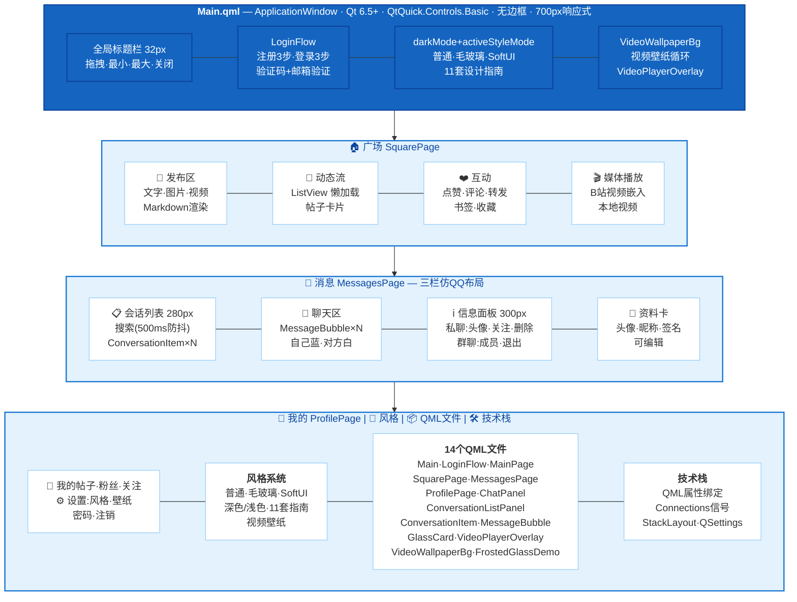

# L1 前端展示层 — Qt 6 QML UI

> 导出：`mmdc -i docs/L1_前端.md -s 3 -w 1600 -H 900 -b "#f8f9fa"`

```mermaid
flowchart TB
    classDef hdr fill:#1565c0,stroke:#0d47a1,stroke-width:2px,color:#fff
    classDef row fill:#e3f2fd,stroke:#1976d2,stroke-width:2px,color:#0d47a1
    classDef it fill:#fff,stroke:#90caf9,stroke-width:1px,color:#333

    subgraph H["<b>Main.qml</b> — ApplicationWindow · Qt 6.5+ · QtQuick.Controls.Basic · 无边框 · 700px响应式"]
        direction LR
        H1["全局标题栏 32px<br/>拖拽·最小·最大·关闭"] --- H2["LoginFlow<br/>注册3步·登录3步<br/>验证码+邮箱验证"]
        H2 --- H3["darkMode+activeStyleMode<br/>普通·毛玻璃·SoftUI<br/>11套设计指南"] --- H4["VideoWallpaperBg<br/>视频壁纸循环<br/>VideoPlayerOverlay"]
    end

    H --> R1

    subgraph R1["🏠 广场 SquarePage"]
        direction LR
        R1a["📝 发布区<br/>文字·图片·视频<br/>Markdown渲染"] --- R1b["📰 动态流<br/>ListView 懒加载<br/>帖子卡片"]
        R1b --- R1c["❤️ 互动<br/>点赞·评论·转发<br/>书签·收藏"] --- R1d["🎬 媒体播放<br/>B站视频嵌入<br/>本地视频"]
    end

    R1 --> R2

    subgraph R2["💬 消息 MessagesPage — 三栏仿QQ布局"]
        direction LR
        R2a["📋 会话列表 280px<br/>搜索(500ms防抖)<br/>ConversationItem×N"] --- R2b["💭 聊天区<br/>MessageBubble×N<br/>自己蓝·对方白"]
        R2b --- R2c["ℹ️ 信息面板 300px<br/>私聊:头像·关注·删除<br/>群聊:成员·退出"] --- R2d["👤 资料卡<br/>头像·昵称·签名<br/>可编辑"]
    end

    R2 --> R3

    subgraph R3["👤 我的 ProfilePage  |  🎨 风格  |  📦 QML文件  |  🛠️ 技术栈"]
        direction LR
        R3a["📄 我的帖子·粉丝·关注<br/>⚙️ 设置:风格·壁纸<br/>密码·注销"] --- R3b["<b>风格系统</b><br/>普通·毛玻璃·SoftUI<br/>深色/浅色·11套指南<br/>视频壁纸"]
        R3b --- R3c["<b>14个QML文件</b><br/>Main·LoginFlow·MainPage<br/>SquarePage·MessagesPage<br/>ProfilePage·ChatPanel<br/>ConversationListPanel<br/>ConversationItem·MessageBubble<br/>GlassCard·VideoPlayerOverlay<br/>VideoWallpaperBg·FrostedGlassDemo"] --- R3d["<b>技术栈</b><br/>QML属性绑定<br/>Connections信号<br/>StackLayout·QSettings"]
    end

    class H,H1,H2,H3,H4 hdr
    class R1,R2,R3 row
    class R1a,R1b,R1c,R1d,R2a,R2b,R2c,R2d,R3a,R3b,R3c,R3d it
```
