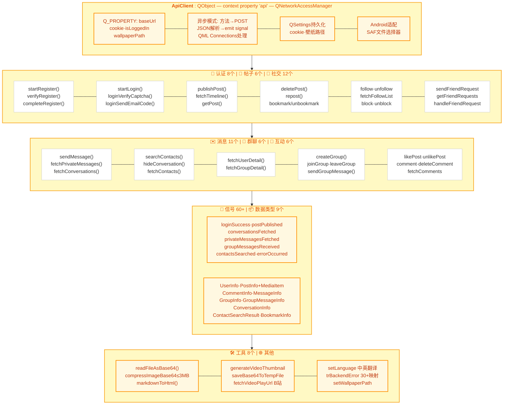

# L2 桥接层 — C++17 ApiClient

> 导出：`mmdc -i docs/L2_桥接.md -o docs/L2_桥接.png -s 3 -w 1600 -H 900 -b "#fffef5"`

```mermaid
flowchart TB
    classDef root fill:#fff9c4,stroke:#f9a825,stroke-width:2px,color:#e65100
    classDef grp fill:#fff8e1,stroke:#ff8f00,stroke-width:2px,color:#bf360c
    classDef it fill:#ffffff,stroke:#ccc,stroke-width:1px,color:#333

    subgraph HEADER["<b>ApiClient</b> : QObject — context property 'api' — QNetworkAccessManager"]
        direction LR
        H1["Q_PROPERTY: baseUrl<br/>cookie·isLoggedIn<br/>wallpaperPath"] --- H2["异步模式: 方法→POST<br/>JSON解析→emit signal<br/>QML Connections处理"]
        H2 --- H3["QSettings持久化<br/>cookie·壁纸路径"] --- H4["Android适配<br/>SAF文件选择器"]
    end

    HEADER --> ROW1

    subgraph ROW1["🔐 认证 8个  |  📝 帖子 6个  |  👥 社交 12个"]
        direction LR
        A1["startRegister()<br/>verifyRegister()<br/>completeRegister()"] --- A2["startLogin()<br/>loginVerifyCaptcha()<br/>loginSendEmailCode()"]
        A2 --- P1["publishPost()<br/>fetchTimeline()<br/>getPost()"]
        P1 --- P2["deletePost()<br/>repost()<br/>bookmark/unbookmark"]
        P2 --- S1["follow·unfollow<br/>fetchFollowList<br/>block·unblock"]
        S1 --- S2["sendFriendRequest<br/>getFriendRequests<br/>handleFriendRequest"]
    end

    ROW1 --> ROW2

    subgraph ROW2["✉️ 消息 11个  |  👥 群聊 6个  |  💬 互动 6个"]
        direction LR
        M1["sendMessage()<br/>fetchPrivateMessages()<br/>fetchConversations()"] --- M2["searchContacts()<br/>hideConversation()<br/>fetchContacts()"]
        M2 --- M3["fetchUserDetail()<br/>fetchGroupDetail()"]
        M3 --- G1["createGroup()<br/>joinGroup·leaveGroup<br/>sendGroupMessage()"]
        G1 --- I1["likePost·unlikePost<br/>comment·deleteComment<br/>fetchComments"]
    end

    ROW2 --> ROW3

    subgraph ROW3["📡 信号 60+  |  📦 数据类型 9个"]
        direction LR
        SIG["loginSuccess·postPublished<br/>conversationsFetched<br/>privateMessagesFetched<br/>groupMessagesReceived<br/>contactsSearched·errorOccurred"]
        TYP["UserInfo·PostInfo+MediaItem<br/>CommentInfo·MessageInfo<br/>GroupInfo·GroupMessageInfo<br/>ConversationInfo<br/>ContactSearchResult·BookmarkInfo"]
    end

    ROW3 --> ROW4

    subgraph ROW4["🛠️ 工具 8个  |  🌐 其他"]
        direction LR
        U1["readFileAsBase64()<br/>compressImageBase64≤3MB<br/>markdownToHtml()"] --- U2["generateVideoThumbnail<br/>saveBase64ToTempFile<br/>fetchVideoPlayUrl B站"]
        U2 --- O1["setLanguage 中英翻译<br/>trBackendError 30+映射<br/>setWallpaperPath"]
    end

    class HEADER,ROW1,ROW2,ROW3,ROW4 root
    class A1,A2,P1,P2,S1,S2,M1,M2,M3,G1,I1 it
    class H1,H2,H3,H4,SIG,TYP,U1,U2,O1 grp
```
