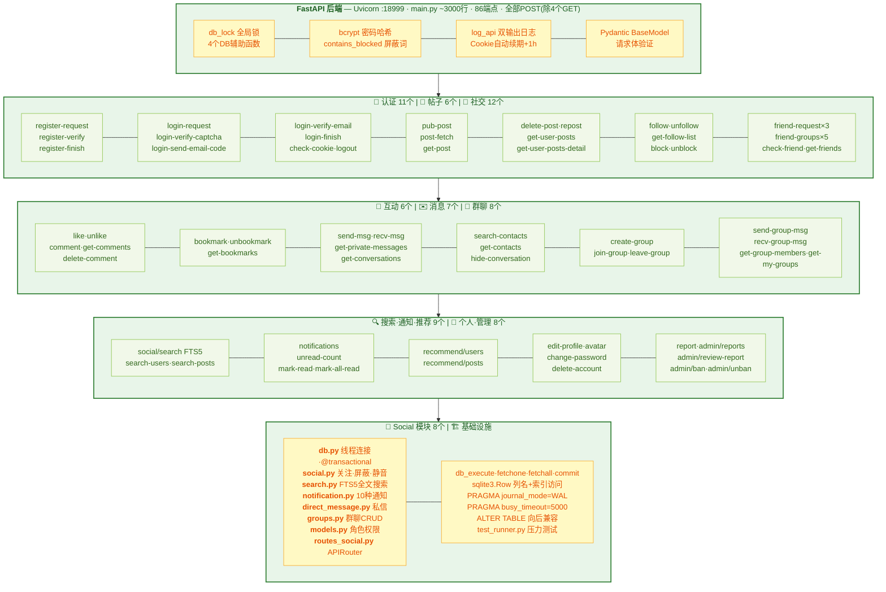

# L3 后端服务层 — Python FastAPI

> 导出：`mmdc -i docs/L3_后端.md -o docs/L3_后端.png -s 3 -w 1600 -H 900 -b "#f5fff5"`

```mermaid
flowchart TB
    classDef root fill:#e8f5e9,stroke:#2e7d32,stroke-width:2px,color:#1b5e20
    classDef grp fill:#c8e6c9,stroke:#388e3c,stroke-width:2px,color:#1b5e20
    classDef it fill:#f1f8e9,stroke:#8bc34a,stroke-width:1px,color:#33691e
    classDef infra fill:#fff9c4,stroke:#f9a825,stroke-width:1px,color:#e65100

    subgraph HEADER["<b>FastAPI 后端</b> — Uvicorn :18999 · main.py ~3000行 · 86端点 · 全部POST(除4个GET)"]
        direction LR
        H1["db_lock 全局锁<br/>4个DB辅助函数"] --- H2["bcrypt 密码哈希<br/>contains_blocked 屏蔽词"]
        H2 --- H3["log_api 双输出日志<br/>Cookie自动续期+1h"] --- H4["Pydantic BaseModel<br/>请求体验证"]
    end

    HEADER --> ROW1

    subgraph ROW1["🔐 认证 11个  |  📝 帖子 6个  |  👥 社交 12个"]
        direction LR
        R1A["register-request<br/>register-verify<br/>register-finish"] --- R1B["login-request<br/>login-verify-captcha<br/>login-send-email-code"]
        R1B --- R1C["login-verify-email<br/>login-finish<br/>check-cookie·logout"]
        R1C --- R2A["pub-post<br/>post-fetch<br/>get-post"]
        R2A --- R2B["delete-post·repost<br/>get-user-posts<br/>get-user-posts-detail"]
        R2B --- R3A["follow·unfollow<br/>get-follow-list<br/>block·unblock"]
        R3A --- R3B["friend-request×3<br/>friend-groups×5<br/>check-friend·get-friends"]
    end

    ROW1 --> ROW2

    subgraph ROW2["💬 互动 6个  |  ✉️ 消息 7个  |  👥 群聊 8个"]
        direction LR
        R4A["like·unlike<br/>comment·get-comments<br/>delete-comment"] --- R4B["bookmark·unbookmark<br/>get-bookmarks"]
        R4B --- R5A["send-msg·recv-msg<br/>get-private-messages<br/>get-conversations"]
        R5A --- R5B["search-contacts<br/>get-contacts<br/>hide-conversation"]
        R5B --- R6A["create-group<br/>join-group·leave-group"]
        R6A --- R6B["send-group-msg<br/>recv-group-msg<br/>get-group-members·get-my-groups"]
    end

    ROW2 --> ROW3

    subgraph ROW3["🔍 搜索·通知·推荐 9个  |  👤 个人·管理 8个"]
        direction LR
        R7A["social/search FTS5<br/>search-users·search-posts"] --- R7B["notifications<br/>unread-count<br/>mark-read·mark-all-read"]
        R7B --- R7C["recommend/users<br/>recommend/posts"]
        R7C --- R8A["edit-profile·avatar<br/>change-password<br/>delete-account"]
        R8A --- R8B["report·admin/reports<br/>admin/review-report<br/>admin/ban·admin/unban"]
    end

    ROW3 --> ROW4

    subgraph ROW4["🧩 Social 模块 8个  |  🏗️ 基础设施"]
        direction LR
        MODS["<b>db.py</b> 线程连接·@transactional<br/><b>social.py</b> 关注·屏蔽·静音<br/><b>search.py</b> FTS5全文搜索<br/><b>notification.py</b> 10种通知<br/><b>direct_message.py</b> 私信<br/><b>groups.py</b> 群聊CRUD<br/><b>models.py</b> 角色权限<br/><b>routes_social.py</b> APIRouter"]
        MODS --- INFRA2["db_execute·fetchone·fetchall·commit<br/>sqlite3.Row 列名+索引访问<br/>PRAGMA journal_mode=WAL<br/>PRAGMA busy_timeout=5000<br/>ALTER TABLE 向后兼容<br/>test_runner.py 压力测试"]
    end

    class HEADER,ROW1,ROW2,ROW3,ROW4 root
    class R1A,R1B,R1C,R2A,R2B,R3A,R3B,R4A,R4B,R5A,R5B,R6A,R6B,R7A,R7B,R7C,R8A,R8B it
    class H1,H2,H3,H4,MODS,INFRA2 infra
```
