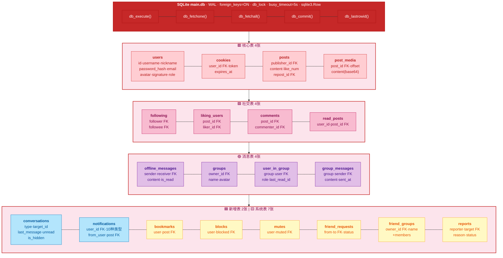

# L4 数据层

> 导出：`mmdc -i docs/L4_数据.md -o docs/L4_数据.png -s 3 -w 1600 -H 900 -b "#fff5f5"`

```mermaid
flowchart TB
    classDef hdr fill:#c62828,stroke:#b71c1c,stroke-width:2px,color:#fff
    classDef row fill:#fce4ec,stroke:#c62828,stroke-width:2px,color:#880e4f
    classDef c1 fill:#ffcdd2,stroke:#d32f2f,stroke-width:1px,color:#b71c1c
    classDef c2 fill:#f8bbd0,stroke:#c2185b,stroke-width:1px,color:#880e4f
    classDef c3 fill:#e1bee7,stroke:#7b1fa2,stroke-width:1px,color:#4a148c
    classDef c4 fill:#b3e5fc,stroke:#0277bd,stroke-width:1px,color:#01579b
    classDef c5 fill:#fff9c4,stroke:#f9a825,stroke-width:1px,color:#e65100

    subgraph H["<b>SQLite main.db</b> · WAL · foreign_keys=ON · db_lock · busy_timeout=5s · sqlite3.Row"]
        direction LR
        H1["db_execute()"] --- H2["db_fetchone()"] --- H3["db_fetchall()"] --- H4["db_commit()"] --- H5["db_lastrowid()"]
    end

    H --> R1

    subgraph R1["🟥 核心表 4张"]
        direction LR
        R1a["<b>users</b><br/>id·username·nickname<br/>password_hash·email<br/>avatar·signature·role"] --- R1b["<b>cookies</b><br/>user_id FK·token<br/>expires_at"]
        R1b --- R1c["<b>posts</b><br/>publisher_id FK<br/>content·like_num<br/>repost_id FK"] --- R1d["<b>post_media</b><br/>post_id FK·offset<br/>content(base64)"]
    end

    R1 --> R2

    subgraph R2["🟪 社交表 4张"]
        direction LR
        R2a["<b>following</b><br/>follower FK<br/>followee FK"] --- R2b["<b>liking_users</b><br/>post_id FK<br/>liker_id FK"]
        R2b --- R2c["<b>comments</b><br/>post_id FK<br/>commenter_id FK"] --- R2d["<b>read_posts</b><br/>user_id·post_id FK"]
    end

    R2 --> R3

    subgraph R3["🟣 消息表 4张"]
        direction LR
        R3a["<b>offline_messages</b><br/>sender·receiver FK<br/>content·is_read"] --- R3b["<b>groups</b><br/>owner_id FK<br/>name·avatar"]
        R3b --- R3c["<b>user_in_group</b><br/>group·user FK<br/>role·last_read_id"] --- R3d["<b>group_messages</b><br/>group·sender FK<br/>content·sent_at"]
    end

    R3 --> R4

    subgraph R4["🟦 新增表 2张  |  🟨 系统表 7张"]
        direction LR
        R4a["<b>conversations</b><br/>type·target_id<br/>last_message·unread<br/>is_hidden"] --- R4b["<b>notifications</b><br/>user_id FK·10种类型<br/>from_user·post FK"]
        R4b --- R4c["<b>bookmarks</b><br/>user·post FK"] --- R4d["<b>blocks</b><br/>user·blocked FK"]
        R4d --- R4e["<b>mutes</b><br/>user·muted FK"] --- R4f["<b>friend_requests</b><br/>from·to FK·status"]
        R4f --- R4g["<b>friend_groups</b><br/>owner_id FK·name<br/>+members"] --- R4h["<b>reports</b><br/>reporter·target FK<br/>reason·status"]
    end

    class H,H1,H2,H3,H4,H5 hdr
    class R1,R2,R3,R4 row
    class R1a,R1b,R1c,R1d c1
    class R2a,R2b,R2c,R2d c2
    class R3a,R3b,R3c,R3d c3
    class R4a,R4b c4
    class R4c,R4d,R4e,R4f,R4g,R4h c5
```
